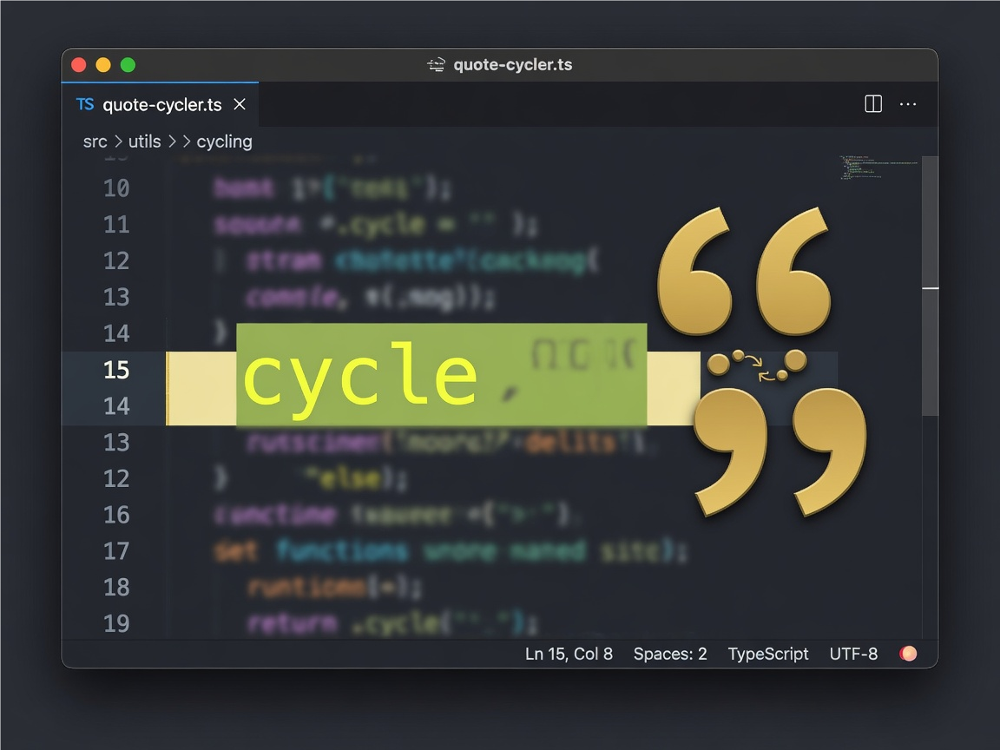

  

# Quote Switcher

**Cycle string quotes without changing the value**

  
  
  

---

### Getting started

1) Clone [gvastethecreator/vscode-quote-switcher](https://github.com/gvastethecreator/vscode-quote-switcher), then run `pnpm install`.
2) Press F5 (`Run Extension`).
3) Select a string, then run **Cycle Quotes**.

---

  
  <a href="https://github.com/gvastethecreator"><picture><source media="(prefers-color-scheme: dark)" srcset="https://shieldcn.dev/badge/follow%20me-/gvastethecreator.png?size=xs&amp;logo=github&amp;brand=github&amp;mode=dark"></picture></a>
  <a href="https://github.com/sponsors/gvastethecreator"><picture><source media="(prefers-color-scheme: dark)" srcset="https://shieldcn.dev/badge/support%20this-project.png?size=xs&amp;logo=ri%3APiHeartFill&amp;logoColor=b85a90&amp;brand=github&amp;mode=dark"></picture></a>

